# STREAM On The Beach

[Accueil]( ./index.html )

## Tuotoriel Caméra

Le studio est équipé de 2 caméras Pocket Cinema 4k Blackmagic, chacune mise en place sur deux trépieds.

Vous pourrez trouver les informations complètes sur le fonctionnement ou les capacités de la caméra directement depuis le site de l’appareil Blackmagic Design ou sur la notice fournie avec l’appareil.

## 1 - Caractéristiques de la caméra :

Face avant :

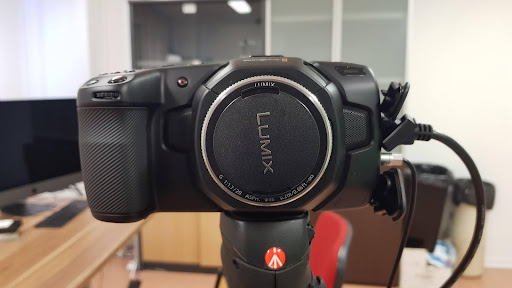

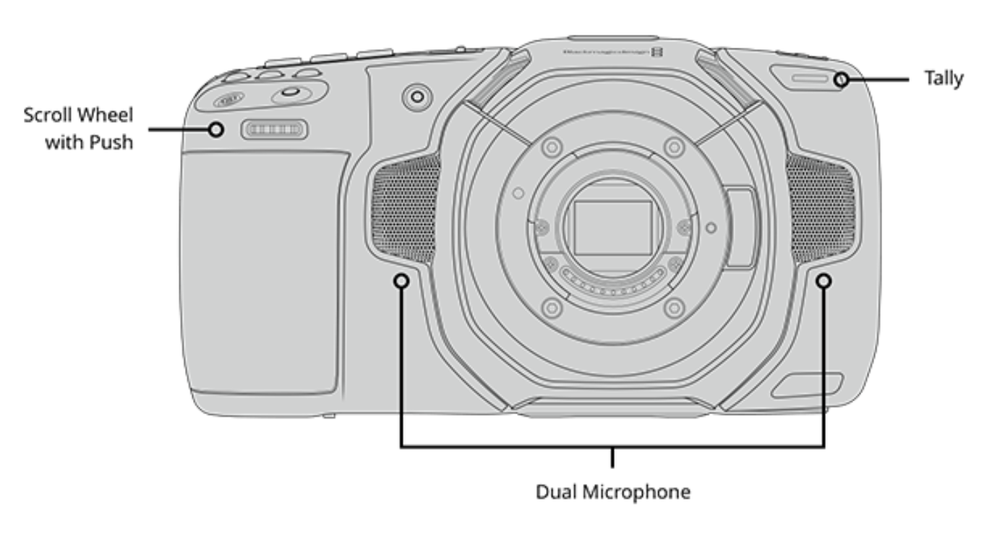

Vu du dessus :

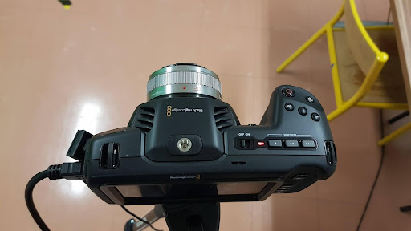

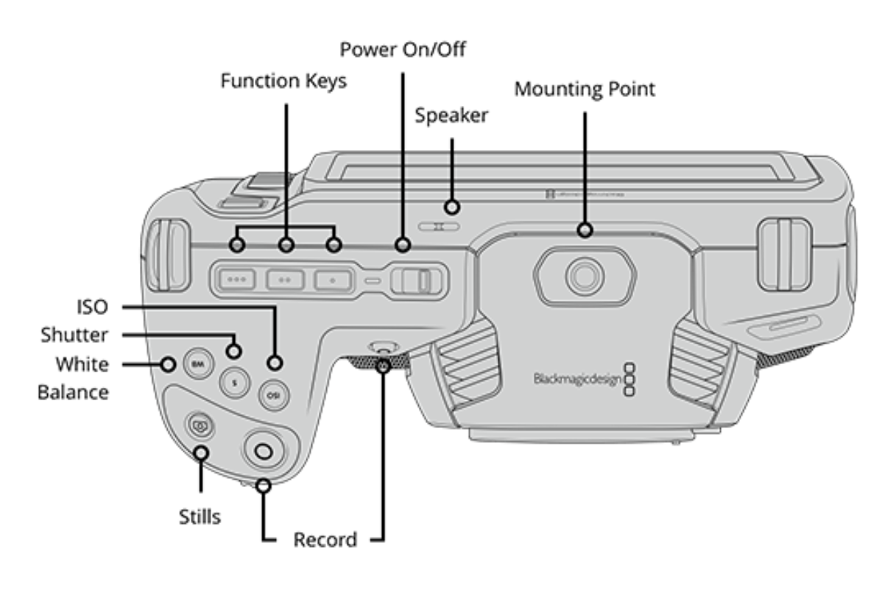

Le ‘Mounting Point’ correspond au positionnement d’un potentiel flash et le bouton ‘stills’ à la prise de photographie.

Côté gauche :

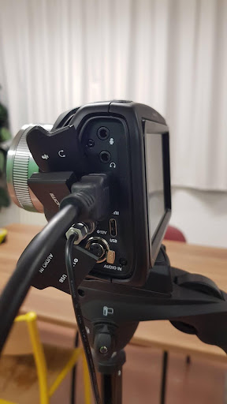

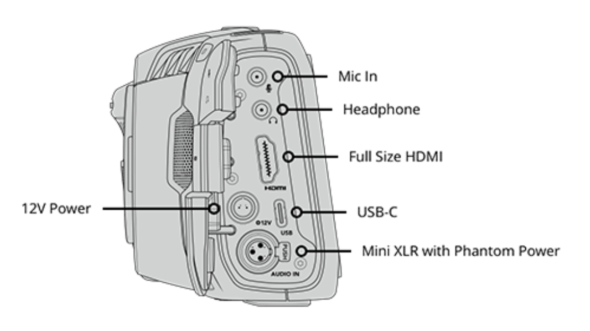

Zone de branchement des câbles; le câble HDMI permet de faire la liaison avec l’ordinateur, et l’emplacement 12V Power correspond au câble d’alimentation.

Face arrière :

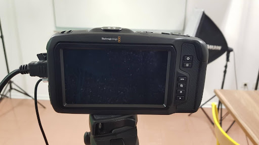

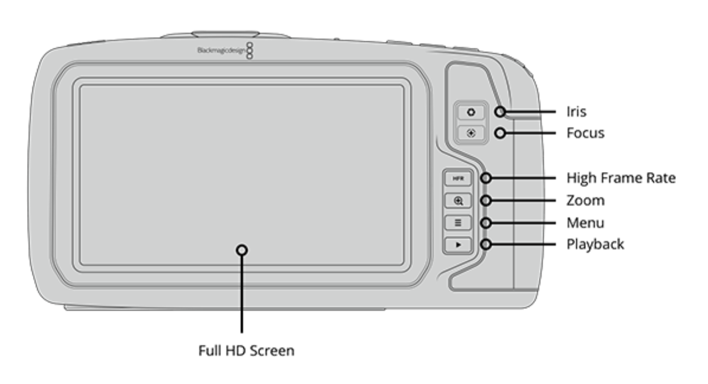

Coté droit :

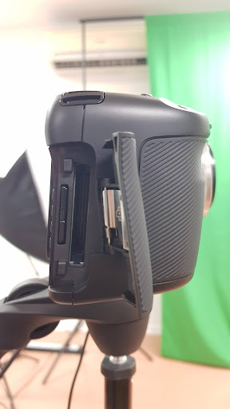

Vu de dessous :

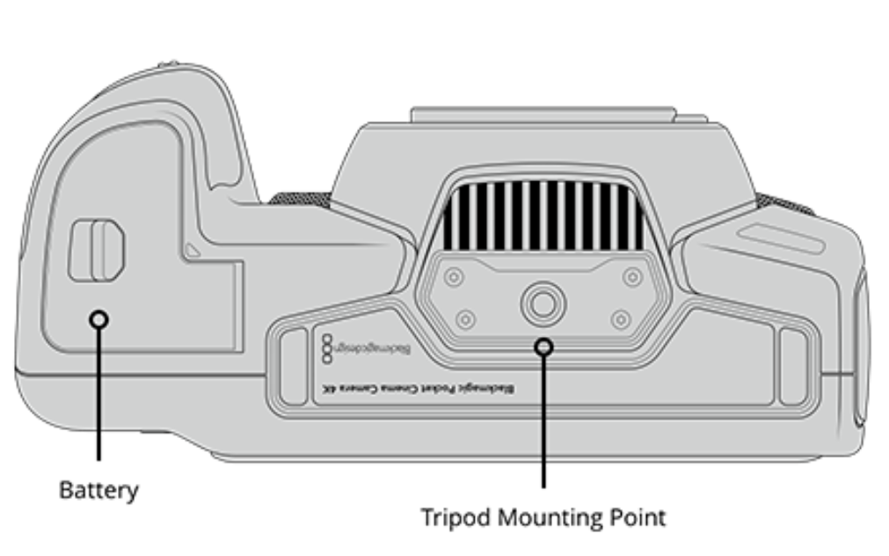

Affichage principal de prise vidéo :

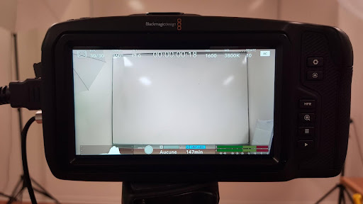

## 2 - Quelques notions importante pour les réglages :

Réglage de l’ISO

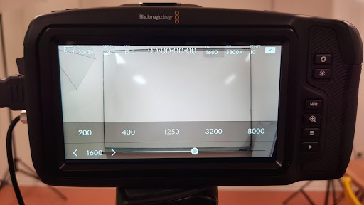

La valeur de l’ISO correspond à la quantité de lumière qui atteint le capteur de la caméra. Ainsi plus il est élevé, plus l’image sera lumineuse.

Balance des blancs :

La balance des blancs va impacter sur la température des couleurs lors de la prise vidéo. On la mesure en Kelvin.

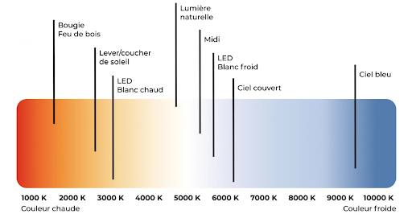

Ainsi le réglage des blancs est nécessaire afin de calibrer la vidéo pour que le blanc apparaisse réellement blanc en retour et pas beige ou bleuté. Et qu’ainsi les autres couleurs apparaissent à l’oeil nu de façon naturelle par rapport au blanc.

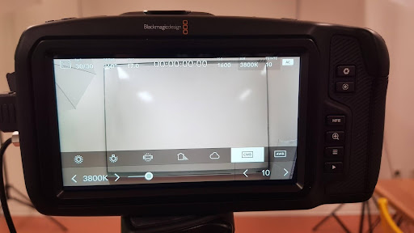

Choix de la fréquence d’image :

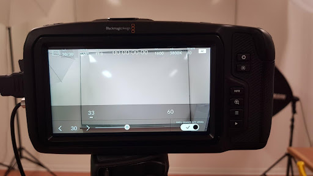

On va parler ici du nombre d'images par seconde prises par la caméra. Le choix de la fréquence d’image se compte en fps : “frame per seconds”. Il y a de multiples options, cependant il est important de rester cohérent et de ne pas modifier la cadence d’image au cours d’un même tournage.

Trois fréquences sont régulièrement employées : 24 fps, 25 fps et 30 fps, respectivement les standards du cinéma, en europe et le dernier aux USA et en Asie.

Il faut tout de même faire attention que l’augmentation de la fréquence d’image présente des contreparties. Le stockage est ainsi plus important, la vidéo nécessite un plus fort besoin de lumière et le format peut ne pas être supporté par certains outils numériques (notamment les plateformes de diffusion).

Choix de la focale :

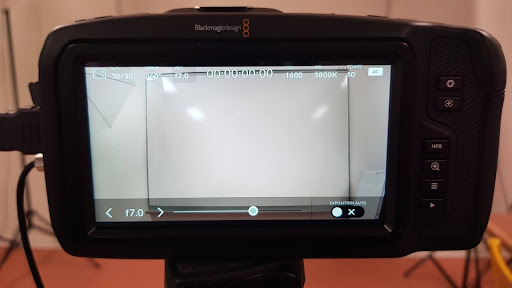

Régler la focale signifie régler la quantité de lumière que l’objectif laisse entrer dans l’appareil grâce au fonctionnement du diaphragme.

La valeur de la focale va de f/1.8 à f/22. A savoir que plus le chiffre est petit, plus l’ouverture est grande.

Réglage de la vitesse d’obturation / Exposition /

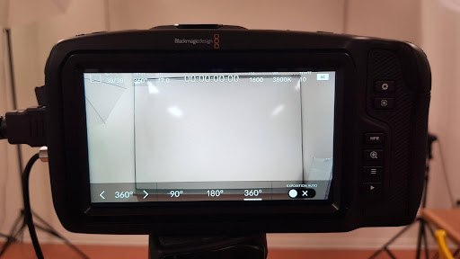

La vitesse d’obturation correspond au temps de pose du cliché, c'est-à-dire le temps suite au déclenchement de la photo entre l’ouverture et la fermeture de l’obturateur.

Lorsque celui-ci est ouvert, la lumière atteint le capteur et la photo prend forme.

Si la vitesse d'obturation est grande, les mouvements rapides seront mieux captés à l’inverse un faible vitesse est conseillée en cas de scène sombre afin que l’appareil capte le maximum de lumière. Ainsi l’obturation peut amener la sur-exposition ou la sous-exposition de la photo.

Actuellement, la caméra présente des angles d’obturation. Mais cela peut être modifié en vitesse d’obturation dans les réglages.

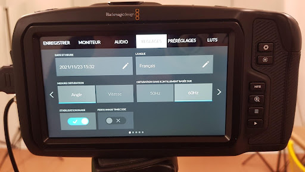

## 3 - Accès à quelques réglages plus spécifiques :

Menu LUTS
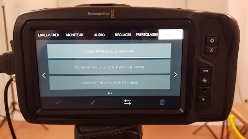

Dans ce menu vous pouvez choisir le format de prise vidéo et celui d’export. Attention, tout filmer en 4K prend énormément de place de stockage.

Menu PRÉRÉGLAGES
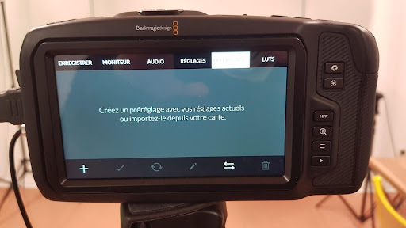

Il est possible sur les caméras Blackmagic d’enregistrer un réglage. Pour celà il faut être sûr de toujours filmer dans les mêmes conditions de lumière.

Menu REGLAGES
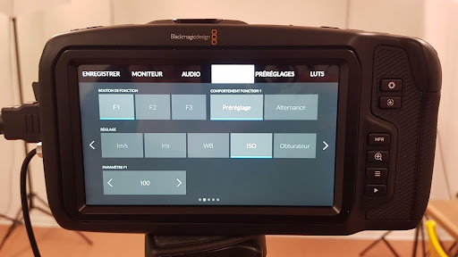
Dans cet onglet du menu vous pouvez définir les réglages qui s'effectueront sur les boutons F1, F2, F3. Ces trois boutons permettent d’effectuer de simples réglages en accès rapide.

Menu AUDIO
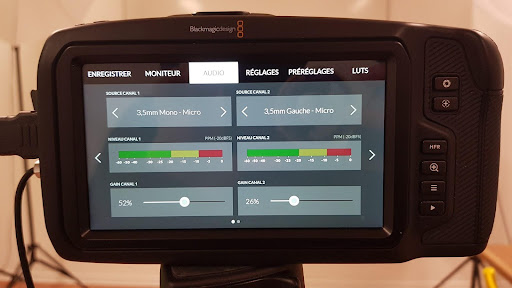

Dans le menu, il existe un réglage des fonctions audios.

Menu ENREGISTRER
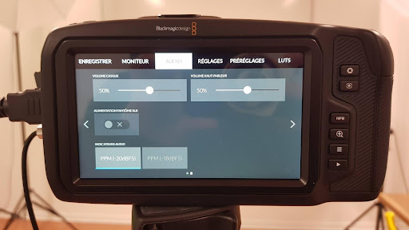

## 4 - Bilan :

Le réglage de la caméra peut devenir assez complexe mais reste cependant nécessaire pour obtenir une bonne qualité vidéo finale. Ainsi, il faut bien évidemment coordonner les différents réglages. Mais en cas de doute les caméras du studio offrent la possibilité d'un réglage automatique pour chacun des paramètres.

Sources :

https://www.blackmagicdesign.com/fr/products/blackmagicpocketcinemacamera

http://tontonphoto.fr/categorie/niveau-debutant/

https://lesvoyagesdetaco.fr/
resolution-frequence-images-meilleurs-reglages/

