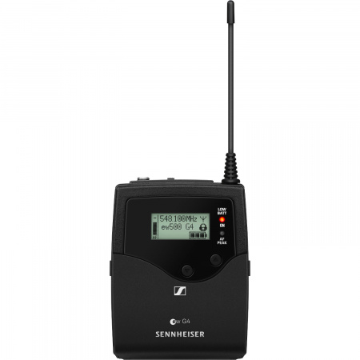

# STREAM On The Beach

[Accueil]( ./index.html )

## Micro Sans fil SENNHEISER - ew G4

Ce micro est composé de deux parties : un récepteur et un émetteur.

### L’émetteur : SK 100 G4

Ce boîtier est placé sur la personne à enregistrer (dans une poche par exemple). Le micro externe est branché sur la prise Jack (3,5 mm) du boîtier, et de l’autre côté est clipsé près du col de la personne.

Il suffit de mettre en route le boîtier avec le bouton ON/OFF situé sous le capot inférieur.

### Le récepteur : EK 100 G4
  
Ce boîtier est branché directement au port microphone de la caméra. Comme pour l’émetteur, il suffit de la mettre en marche avec le bouton ON/OFF situé sous le capot inférieur.

### Faire apparaître ce micro sur OBS ?

Pour que le son enregistré soit celui provenant du micro, il suffit de rajouter une source audio en entrée sur votre scène (Capture d’une entrée audio). Dans les paramètres de cette nouvelle source, il suffit alors de sélectionner le Mini Recorder Blackmagic correspondant (celui relié à la caméra).

Faire attention :
le micro est assez sensible au bruit environnant : attention au bruissement des vêtements et bruits parasites pendant les enregistrements

## Utilisation d’un autre micro :

Le principe d’utilisation sera très semblable à celui du microphone Sennheiser. Il suffira de brancher le câble de sortie du microphone à une des caméras (et rajouter l’entrée audio sur OBS).

Deux cas :
- Branchement Jack 3,5 mm : il peut se brancher directement sur la caméra. 
- Branchement Jack 6,35 mm : il faut utiliser un adaptateur Jack 6,35 mm vers 3,5 mm.
- Branchement XLR : on ne pourra pas le brancher sur une caméra directement, il faudra passer par une carte son ou une table de mixage.
