# STREAM On The Beach

[Accueil]( ./index.html )

## Tuotoriel OBS - Open Broadcast Software

### OBS, qu’est-ce que c’est ?

C’est un logiciel gratuit et open-source, qui permet l’enregistrement et la diffusion de vidéos.

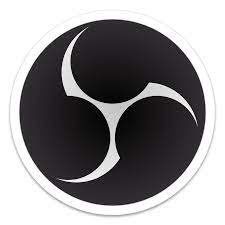

## I - Interface OBS

A l’ouverture du logiciel, la fenêtre suivante s’ouvre :

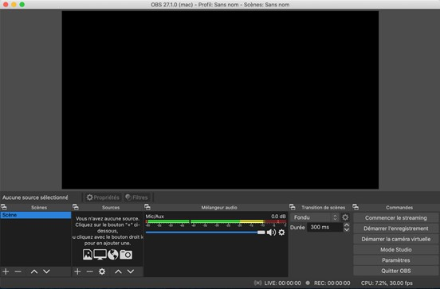

Cette fenêtre est divisée en plusieurs interfaces, chacune avec sa propre fonction.

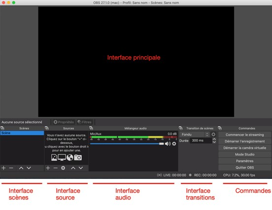
Fonctionnement général d’OBS :

Avant de détailler les fonctions des différentes interfaces, il faut comprendre comment OBS fonctionne. Lors d’un enregistrement vidéo ou d’une diffusion live, c’est l’écran de l’interface principale qui est montré. Il est possible de créer de multiples écrans différents appelés scènes, et de passer de l’une à l’autre durant l’enregistrement. Par exemple: si on filme deux intervenants A et B, une scène pourra montrer uniquement l'intervenant A et une autre montrera les 2 intervenants ensemble. On peut alors passer de l’une à l’autre en sélectionnant la scène choisie.

Les éléments composants chaque scène sont appelés sources. Une source peut être : une image, une vidéo, une webcam, mais également un audio, un micro ! Par exemple, si je souhaite une scène composée d’un diaporama sur tout l’écran et un encadré avec une webcam dans un coin, la scène comprendra 2 sources : le diaporama et la webcam. 

La possibilité de passer d’une scène à une autre durant un enregistrement implique la présence de transitions, entièrement personnalisables pour passer d’une scène à une autre. Par exmple un fondu enchainé sur 200ms ou 300ms, un fondu au noir etc….

### A - Interface scènes :

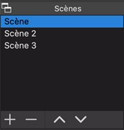

C’est ici que l’on retrouve la liste des scènes.

- Pour ajouter une scène, il suffit de cliquer sur le bouton “+” , une fenêtre s’ouvre alors et vous permet de nommer la nouvelle scène.
- Pour supprimer une scène : bouton “-”
- Pour modifier l’ordre de présentation des scènes : boutons “/\” et ” \/ ”

### B - Interface sources :

C’est l’interface la plus importante car c’est elle qui permet de personnaliser les différentes scènes.

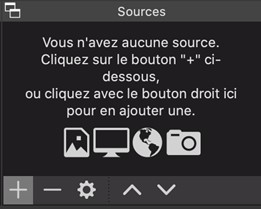

- Bouton + : rajouter une nouvelle source
- Bouton - : supprimer une source existante
- Bouton paramètres : lorsqu’une source est sélectionnée, ce - - - Bouton permet d’ouvrir son menu de propriétés
- Bouton /\ et \/ (ou drag and drop depuis la liste des sources) : modifier l’ordre des sources. La source située tout en haut de la liste sera celle le plus au premier plan, à l’inverse une source en bas de cette liste sera en arrière plan par rapport aux autres.

En appuyant sur le bouton + il est possible de sélectionner le type de source à ajouter parmi un large choix.

Sources disponibles :

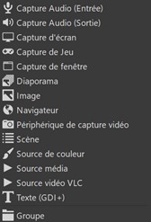

Capture audio (entrée) : permet de récupérer l’audio depuis n’importe quel périphérique, micro intégré à l’ordinateur, aux caméras ou au micro branché sur les caméras.

Capture audio (sortie) : permet de gérer l’audio sortant (par défaut, tous les sons sortants de l’ordinateur)

Capture d’écran : permet de capturer l’écran complet depuis l’ordinateur principal

Capture de jeu (client syphon):

Capture de fenêtre : permet de capturer une fenêtre en particulier depuis l’ordinateur principal

Diaporama : il suffit d’ajouter les fichiers images que l’on souhaite voir en diaporama, les transitions se font automatiquement et il est possible de régler la vitesse de défilement

Image : ajout d’un fichier image au choix

Navigateur : partage d’écran du navigateur utilisé

Périphérique de capture vidéo : permet d’afficher l’entrée image depuis un périphérique connecté à l’ordinateur principal : caméra, webcam intégrée.

Scène : permet d’ajouter une scène complète dans une autre.

Utile par exemple pour utiliser le fond vert.

Source de couleur : fond coloré, couleur au choix

Source média : permet la lecture d’une vidéo locale, en boucle ou non.

Source vidéo VLC : permet la lecture d’une vidéo

Texte : ajout texte, police, taille et couleur au choix

Groupe : Insérer un groupe de sources déjà configuré au préalable.

Une fois la source ajoutée, il est possible de la déplacer et de modifier sa taille depuis l’interface principale.

### C - Interface audio :

Cette interface permet de gérer ce qui touche à l’audio. Les différentes sources audio sont listées dans le mélangeur, qui affiche le niveau sonore en temps réel de chacune des pistes. Il faut toujours que le niveau global reste dans la zone verte (quelques pics en zone orange sont tolérables, mais la zone rouge est à éviter !!!). Il est possible de baisser le niveau audio global en ajustant le curseur sous la piste associée. Pour couper le son d’une des sources : il suffira de baisser au minimum le curseur associé.

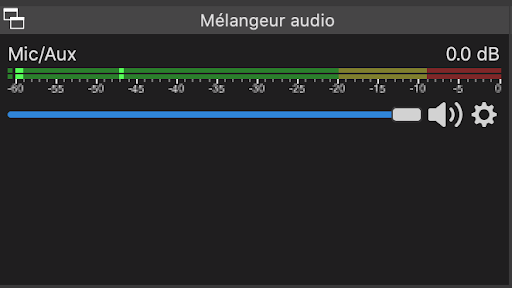

### D - Transitions  : 

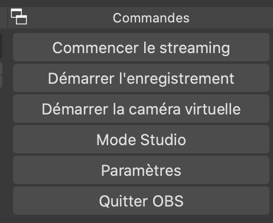

Cette interface permet de définir quelle transition sera utilisée pour passer d’une scène à l’autre. Il faut savoir que la même transition sera appliquée pour toutes les transitions.

Si l’on souhaite utiliser des transitions variées pour passer d’une scène à l’autre, le mode Studio (voir partie dédiée) permet d’enregistrer des “Transitions rapides” (sortes de raccourcis). En cliquant sur la transition voulue, on passe de la scène précédente à la nouvelle via la transition choisie.

Les transitions peuvent être personnalisées en forme et en durée.

- Transitions disponibles :
- Coupure 
- Fondu 
- Glissement
- Balayage
- Stinger
- Fondu au noir

### E - Propriétés et filtres

Lorsqu’une source est sélectionnée, les boutons "Propriétés” et “Filtres” deviennent cliquables. Le bouton “Propriétés” permet de ré-ouvrir la fenêtre de création/paramétrage de la source.

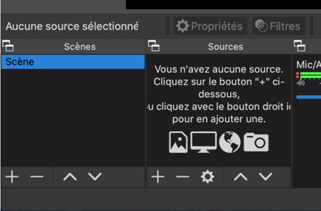

Le bouton filtre permet lui d’ouvrir une nouvelle fenêtre permettant d’ajouter un filtre sur la source, qu’elle soit audio ou vidéo. 

Filtres vidéos :

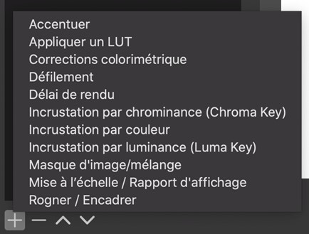

- Accentuer : modification de la netteté
- Appliquer un LUT :(Look-Up Tables)  effet de filtres (sépia, N&B, pseudo infrarouge etc…) De nombreux filtres sont téléchargeables gratuitement sur le web pour trouver un filtre que correspondra à vos envies !
- Corrections colorimétriques : permet la correction de nombreux paramètres de l’image : gamme, contraste, luminosité, saturation, décalage de teinte, opacité
- Défilement : ajout d'un défilement de l’image (vertical, horizontal ou les deux!)
- Délai de rendu : ajout d’un retard au choix
- Incrustation par chrominance (Chroma Key) : à utiliser pour le fond vert ! Permet d’effacer une partie de l’image en fonction de sa couleur : vert / bleu / magenta ou custom (on utilisera le vert)
- Incrustation par couleur : similaire à l’incrustation Chroma - - Key pour utiliser un fond vert, mais privilégiez plutôt Chroma Key
- Incrustation par luminance (Luma Key) : utilisé pour effacer une partie de l’image, mais en se basant sur la luminance et non la couleur.
- Masque d’image/mélange
- Mise à l’échelle/ Rapport d’affichage
- Rogner/Encadrer : permet de rogner l’image. A noter qu’il est possible de rogner une source depuis l’interface graphique directement en maintenant Alt et en déplaçant les bords rouges de la source (ils deviendront verts d’ailleurs)

Filtres d’effet audios :

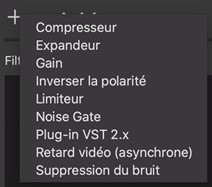

- Compresseur 
- Expandeur
- Gain
- Inverser la polarité
- Limiteur
- Noise Gate
- plug-in VST 2.x
- Retard vidéo (asynchrone)
- Suppression du bruit 

Pour plus de précision sur les différents filtres et leurs utilisations, vous pouvez consulter : 
https://obsproject.com/wiki/Filters-Guide 

## II - Utiliser OBS :

### A - Comment brancher les périphériques vidéo et audio ?

Branchement pour caméra BlackMagic ainsi que ordinateur portable (pour partage d’écran)

Sur l’ordinateur de bureau :
- Ouvrir Préférences Système > Blackmagic Desktop
- Vérifier que tous les Mini Recorder branchés à l’ordinateur apparaissent dans cette fenêtre, et bien vérifier que l'entrée HDMI soit sélectionnée (ou non SDI !)  

### B - Les différentes commandes sur OBS :

- Commencer le streaming : ce bouton permet de débuter un live sur la plateforme de votre choix (Twitch, Youtube etc…) à condition que votre compte soit relié à OBS.
- Démarrer l’enregistrement : ce bouton commence l’enregistrement de l’interface principale d’OBS, lorsque l’enregistrement est en cours ce bouton devient "Arrêter l’enregistrement” qui permet comme son nom l’indique d'arrêter l’enregistrement.
- Démarrer la caméra virtuelle : la caméra virtuelle d’OBS est une fonctionnalité qui permet d’utiliser l’interface principale d’OBS en tant que webcam dans un logiciel de communication à distance comme Zoom ou Microsoft Teams. Pour cela il suffit de composer la scène que l’on souhaite afficher en caméra virtuelle, puis d’activer le bouton “Démarrer la caméra virtuelle”. C’est ensuite directement sur le logiciel de communication à distance qu’il devient possible de sélectionner la webcam à utiliser : “OBS Virtual Camera”. Par exemple sur Zoom :

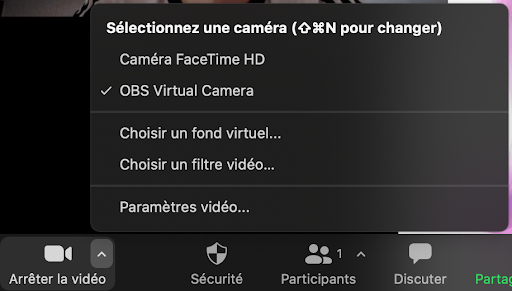

- Mode studio : à l’activation du mode Studio, l’interface d’OBS est modifiée, elle devient :

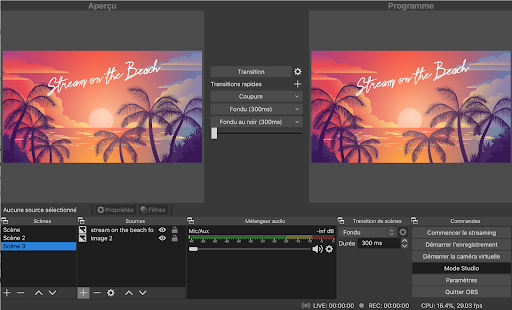

Le mode Studio est particulièrement intéressant pour les lives, car il permet de modifier une scène x alors que les viewers voient une scène y. Il est donc extrêmement intéressant lorsqu'il faut modifier lors d’un live une scène, sans que tous les viewers puissent voir ce qui est en train d’être fait.
L’écran de gauche est en réalité l’interface principale classique où il est possible de modifier, déplacer les sources (aucun changement par rapport au mode classique). 
L’écran de droite est en réalité la vue “Studio”, c’est-à-dire ce que voient les spectateurs lorsqu’un live est actif ou alors ce qui est réellement enregistré lorsqu’un enregistrement est en cours. Aucune modification ne peut être faite directement sur cet écran, il faut toujours modifier l’écran principal (celui de gauche).

## III - Ressources : 

Get started in 7 minutes :

https://www.youtube.com/watch?v=Muk9LfEWHeU&ab_channel=bai

Tutorial for beginners (28 minutes)

https://www.youtube.com/watch?v=-puA85ciDEM

Guide Filtres Audio et Vidéo :

https://obsproject.com/wiki/Filters-Guide

Tutoriel fond vert (simple) :

https://www.youtube.com/watch?v=kBj4zY5RmGw&t=173s&ab_channel=Voorny

Réglages avancés OBS (Réglages Qualité vidéo)

https://www.youtube.com/watch?v=wrw4r5iVtZ8&ab_channel=Frelahar

