# STREAM On The Beach

[Accueil]( ./index.html )

## Première Pro

### I. Les bases de Première Pro

#### 1)- Ouverture de Première Pro

Étape 1 : Pour débuter l’utilisation de Première Pro, cliquer sur : Nouveau projet.

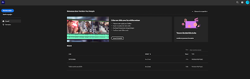

Figure 1 : écran d’accueil de Première Pro

Étape 2 : Il faut d’abord nommer le projet et ensuite sélectionner l’emplacement du projet. 

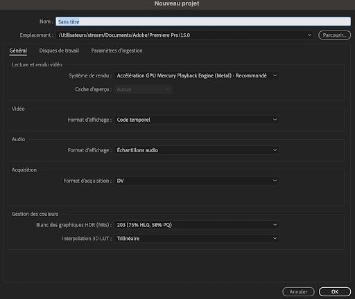

Figure 2 : Fenêtre nouveau projet

#### 2)- Interface de montage

Voici l’interface de montage :

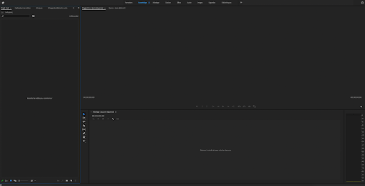

Figure 3 : interface de montage

C’est la première interface que vous devez voir après les étapes de la partie 1. Si ce n’est pas le cas, il suffit de cliquer sur fenêtre puis Espaces de travail et de sélectionner Montage ou Montage CS5.5.

Vous pouvez alors apercevoir plusieurs panneaux :
- le panneau projet : il contient les médias importés ainsi que les séquences créées.
- le panneau montage : il permet de faire toute la partie montage.
- le panneau programme : il permet de visualiser la séquence créée.

#### 3)- Importer des éléments sur Première Pro

Sur Première Pro vous pouvez importer divers fichiers comme des photos, des vidéos ou encore des pistes audio. Il y a plusieurs manières d’importer des fichiers sur Première Pro.

Une des manières est de placer votre souris dans le panneau projet. Il faut ensuite effectuer un clique droit et sélectionner importer. Il suffit alors de choisir vos fichiers sur votre ordinateur.

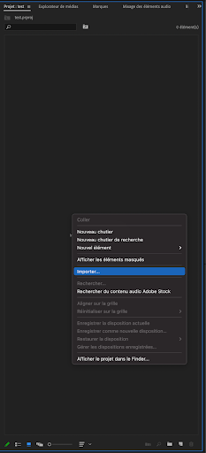

Figure 4 : Importer des fichiers dans le panneau projet

Une seconde manière peut-être simplement de faire glisser vos fichiers dans le panneau projet de première pro.

#### 4)- Exportation de la vidéo terminée

Pour exporter une vidéo, il suffit de cliquer sur fichier et exporter, une nouvelle fenêtre va alors s’ouvrir.
Il faut d’abord identifier où la vidéo va être publiée.Il y a des préconfigurations faites pour les réseaux sociaux. Pour chaque réseau, il faut choisir la meilleure qualité. Par exemple, pour Youtube il faut choisir la préconfiguration YouTube 2160p 4K Ultra HD. 
Il est possible de choisir de ne pas importer la vidéo ou l’audio, à ce moment-là la préconfiguration passe en mode personnalisé (il est préférable d’exporter les 2 tout de même).

### II. Les bases du montages

#### 1)- Importer les fichiers dans le panneau montage

Pour importer un fichier, il suffit de le faire glisser du panneau projet vers le panneau montage. 
Si le fichier importé est une vidéo, il y aura deux barres : une pour la vidéo sans le son et une pour l’audio. Si le fichier est une image, il n’y aura qu’une seule barre. 

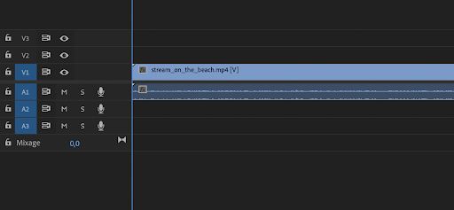

Figure 5 : panneau montage après importation d’une vidéo

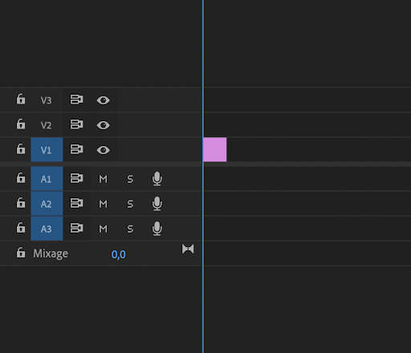

Figure 6 : panneau montage après importation d’une photo

#### 2)- Visualisation de la séquence dans le panneau programme

Pour bien visualiser la vidéo importée dans le panneau montage, il est important de bien réaliser les réglages dans le panneau programme.
Pour que la vidéo à visualiser prenne exactement la taille du panneau programme, il suffit de choisir adapter :

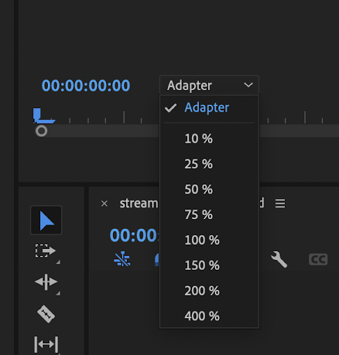

Figure 7 : sélection Adapter dans le panneau programme

Sinon, il est toujours possible d’adapter la taille en choisissant différents pourcentages.

Il se peut que la vidéo soit lue plus lentement si elle est trop lourde. Il est alors possible pour éviter cela de rendre la vidéo au format ¼ par exemple plutôt qu’au format intégral. La qualité de la vidéo visionnée sera moins bonne mais c’est simplement pour faciliter la lecture tout au long du montage et ce ne sera pas le cas pour la vidéo finale une fois qu’elle est exportée.

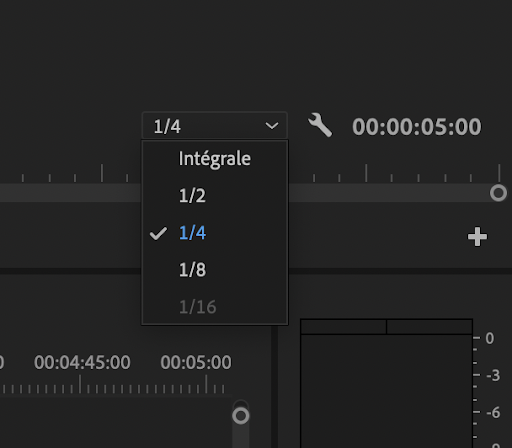

Figure 8 : sélection ¼ dans le panneau programme

#### 3)- Outils de montage

Dans le panneau montage, il y a une barre d’outil :

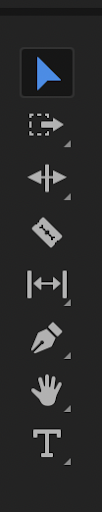

Figure 9 : barre d’outil dans le montage panneau

Le premier outil est l'Outil Sélection.

Le second outil sur la barre est l’Outil Sélection de piste en amont. Il permet de sélectionner tous les éléments en amont de l’élément sélectionné et de les déplacer tous ensemble.

Il est possible que vous n’ayez pas choisi de prendre toute la vidéo mais seulement une séquence que vous avez placée dans le panneau montage. Si finalement vous décidez que la séquence choisie est trop courte et que vous souhaitez la rallonger, cela est possible grâce au troisième outil : l’Outil Allongement. Il vous permet de rallonger une séquence et décale automatiquement les séquences se trouvant en amont de la vidéo sélectionnée.

Le quatrième outil est l’Outil Cutter. Il permet de couper une séquence. 

Le cinquième outil est l’Outil Déplacer la sélection.

Le sixième outil est l’Outil Plume, il permet de créer une forme sur laquelle il est ensuite possible de travailler. 

Lorsque l’image dans le panneau programme est zoomée, le septième outil (l’Outil Main) permet de déplacer l’image dans le panneau programme.

Le huitième outil est l’Outil Texte, il permet d’ajouter du texte (titre, légende,...). 

Il y a ensuite d’autres outils :

Figure 10 : Autres outils du panneau montage

Les cadenas (Activer/Vérouillage de la piste) à côté des séquences permettent de verrouiller une séquence et donc il est impossible de la supprimer par exemple.

L’outil Activer/Vérouillage de synchronisation permet d'insérer un fichier dans la partie montage sans décaler les éléments pour lesquels vous aurez sélectionné cet outil. 

L’outil symbolisé par un œil (Activer/Visibilité de la piste) permet de masquer ou non les séquences se trouvant sur la ligne.

Pour l’audio, l’outil symbolisé par M (Piste muette) permet de rendre muette ou non une piste audio.

L’outil symbolisé par S (piste solo) permet d’isoler une piste audio : seulement cette piste sera lue. 

Il y aussi ces outils là :

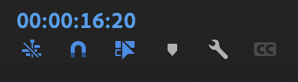

Figure 11 : Outils du panneau montage

Il y a l’outil Aligner dans le montage (symbolisé par un aimant),  qui permet que dès que vous déplacez des séquences, elles se juxtaposent directement aux autres.

Il y a l’outil Sélections liées qui sélectionne automatiquement les fichiers liés (souvent la séquence et l’audio). Pour rompre le lien entre deux fichiers, il suffit de faire un clique droit et de choisir de rompre le lien. 

L’outil Marque permet de mettre des marqueurs si cela est nécessaire.

L’outil Paramètre d’affichage de la séquence symbolisé par la clé à outil est les paramètres avancés. 

Astuce : Pour supprimer une séquence qui se trouve entre deux autres séquences et raccorder les deux autres séquences, il suffit de faire un clique droit et de faire supprimer et raccorder.

### III. Travailler avec des images

#### 1)- Superposer des calques à une vidéo

Pour superposer des calques (images) sur une séquence dans la partie montage, il suffit juste de faire glisser des calques et de les placer au-dessus de la vidéo dans la partie montage. Ainsi le calque s'affiche sur la vidéo.

Pour aller plus loin, il suffit de sélectionner un calque dans le panneau montage et d’aller dans le panneau source et cliquer sur option d’effet. Il est alors possible de modifier plusieurs effets comme la trajectoire ou l’opacité.

#### 2)- Positionner une image sur l’écran

Il faut aller sur le panneau programme lorsqu’il y a l’image. Il suffit alors de dézoomer (10 %) et de double cliquer sur l’image. Celle-ci sera sélectionnée et il est alors possible de modifier sa taille et son positionnement sur l’écran.

### IV. Ajouter des effets

Il est possible d’ajouter de nombreux effets à vos montage comme par exemple des transitions, des effets audios, des changement de couleurs, …

Pour cela il suffit d’aller dans le panneau explorateur de média et ensuite de sélectionner Effet. Vous sélectionnez alors l’effet que vous voulez appliquer et vous le déplacez sur la séquence que vous voulez modifier dans le panneau montage.

Ensuite, il faut aller dans le panneau source et cliquer sur option d’effet et il y aura tous les détails qui concernent cet effet là, il suffit alors de modifier comme vous le désirez.

### V. Travailler avec un fond vert 

Il faut tout d’abord importer la vidéo avec le fond vert ainsi que l’image que vous souhaitez incruster.

Sur première pro, la piste la plus basse dans le panneau montage est celle qui est visionnée. Par exemple, si il y a deux vidéos qui sont placée l’une au dessus de l’autre sur le panneau montage, comme ci-dessous :

  

Figure 12 : deux vidéos dans le panneau montage

C’est la vidéo qui est placée en dessous qui apparaît à l’écran et non celle au-dessus. 

La méthode qui va être expliquée est d’enlever le fond vert, s’il n’y a pas d’image la partie verte deviendra noire. Il faut donc faire attention au position des fichiers dans l’espace montage : l’image qui va remplacer le fond vert doit être placé le plus bas et la vidéo doit être placée au dessus de l’image.

#### 1)-  Le fond vert est bien lisse et uniforme

Après avoir placé les fichiers comme expliqué ci-dessus, il va falloir utiliser l’effet UltraKey.

Étape 1 : Aller dans le panneau projet et sélectionner la fenêtre Effets. Pour trouver l’effet UltraKey, il suffit alors de taper le nom de celui-ci dans la barre de recherche. 

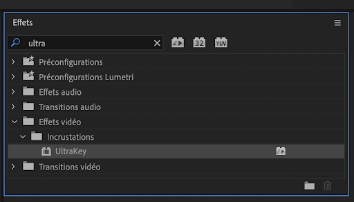  

Figure 13 : fenêtre Effets

Étape 2 : Il faut ensuite glisser l’effet UltraKey sur la vidéo dans la partie montage.

Étape 3 : Dans la fenêtre Options d’effet, sélectionnez la pipette et cliquez avec sur le fond vert dans le panneau ou se trouve l’aperçu de votre montage. Le fond vert doit alors disparaître et vous pouvez visualiser l’image souhaitée à la place de celui-ci. 

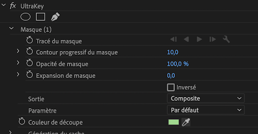 
 
Figure 14 : UltraKey

Astuce : Il se peut qu’il reste du vert autour des objets, il suffit alors de changer les paramètres de l’effet. Il faut passer de par défaut à dynamique. 

#### 2)-  Le fond vert n’est pas lisse et uniforme

Si lors de la vidéo vous pouvez visualiser des ombres ou des plis sur le fond vert, il risque de rester du vert et des imperfections avec la technique précédente. 

Premièrement, il faut réaliser les étapes décrites à la partie précédente. Pour l’étape 3, pour cliquer sur le fond vert il faut choisir l’endroit où il y a le vert qui est le plus présent sur l’image. 

Ensuite, dans la fenêtre Options d’effet il faut modifier les différents paramètres dans Génération du cache. 

Astuce : pour voir les endroits qui ne se sont pas bien enlevé de votre fond vert, passer dans la partie sortie de composite à couche alpha. Les parties apparaîtront alors en blanc. 

Liens :

- www.youtube.com/watch?v=rIHkdGDb3_E
- helpx.adobe.com/fr/premiere-pro/how-to/work-explore-panels.html
- helpx.adobe.com/fr/premiere-pro/how-to/import-with-media-browser.html
- www.youtube.com/watch?v=Co8Pe493Buk&t=181s
