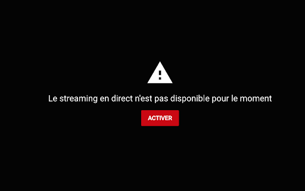
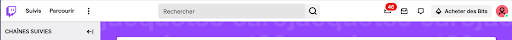
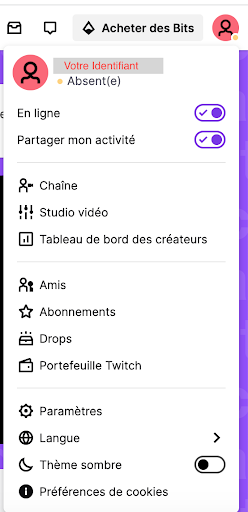

# STREAM On The Beach

[Accueil]( ./index.html )

## Les plateformes Youtube et Twitch

## I - Youtube

### 1 - Importer une vidéo :

Vous avez réalisé votre première vidéo, mais il faut maintenant la diffuser : Youtube est la plateforme de référence.

Pour les créateurs, il existe une partie de Youtube appelée : “Youtube Creator Studio”
Une fois votre chaîne créée, il vous suffit d’aller sur la page principale de votre chaîne, puisque la chaîne n’a pas encore de vidéos, elle sera bien entendu vide. Il vous suffit alors de cliquer sur “Mettre en ligne une vidéo”. Une fenêtre s’ouvre alors vous permettant d’importer la vidéo de votre choix.

Mettre en ligne une vidéo sur Youtube est très simple et guidé, il vous suffira de suivre les étapes proposées par le site. 

Quelques points notables :
- La miniature de la vidéo peut être définie lors de l’importation, si vous n’en avez pas une de prévu une image de la vidéo sera sélectionnée par Youtube par défaut. Pas de panique, elle sera modifiable par la suite.
- Vidéos à destinations d’enfants : la loi COPPA impose des restrictions particulières pour les vidéos à destination d’enfants (jeunes enfants en particulier). En important votre vidéo il vous sera demandé si la vidéo est conçue ou non pour des enfants, dans la majorité des cas il vous faudra cocher non (à part si votre vidéo est conçue pour des enfants bien entendu). Si vous cochez oui, la principale conséquence sera que les commentaires sont désactivés pour la vidéo.
- Une vérification de la vidéo sera effectuée : si des sons non libres de droit sont détectés votre vidéo pourra être suspendue ou non-monétisée.

### 2 - Monétisation :

Pour monétiser ses vidéos, il faut être membre du Programme Partenaire Youtube, pour cela :
- Respecter les règles de monétisation de YT
- Ne pas faire l’objet d’avertissement pour non-respect du règlement de la communauté
- Cumuler plus de 4000 heures de visionnage valides sur des vidéos publiques les 12 derniers mois
- Compter plus de 1000 abonnés
- Posséder un compte AdSense associé

### 3 - Lancer un live Youtube 

Si vous souhaitez diffuser un live depuis Youtube, il vous faut d’abord demander l’activation de votre chaîne pour les lives. Pour cela il suffit de se rendre dans le studio Youtube, de cliquer sur le bouton “Créer” (même bouton que pour importer une vidéo), puis “Passer au direct”. L’écran suivant s’affiche :

Afin d’activer son compte Youtube pour les lives, il faut obligatoirement renseigner un numéro de téléphone pour la chaîne. La validation prend effet 24h après la demande.

## II - Twitch

Je souhaite utiliser le compte Twitch Stream On The Beach
L’OBS de l’ordinateur de la salle est déjà lié à un compte Twitch Stream On The Beach. Il suffit d’ouvrir l’OBS et de cliquer sur “Commencer le stream” pour lancer un live sur la chaîne Twitch.
Un live fonctionne de la même manière qu’un enregistrement. Il est possible de changer de scène, d’effectuer des transitions, d’utiliser le mode Studio depuis l’OBS : les changements seront directement appliqués sur le live.

Note : il y a un décalage de 9 secondes environ entre la réalité et le live.
Note 2 : il n’est pas nécessaire d’ouvrir Twitch sur navigateur lorsqu’on lance un live. Attention ! Le compte est lié, si vous appuyer sur le bouton ‘Commencer le streaming”, un live sera lancé ! Pour éviter les erreurs, une boîte de dialogue demande confirmation avant tout lancement d’un stream.

Je souhaite créer ma propre chaîne Twitch et la lier à l’ordinateur de la salle de Stream

Pour cela il suffit de suivre quelques étapes :

### 1 - Création de compte Twitch

Rendez-vous sur la page d’accueil de Twitch et créez-vous un compte. Vous aurez à choisir votre identifiant et votre mot de passe.
Note : vous pouvez modifier votre identifiant après la création de votre compte, mais attention, une fois modifié vous ne pourrez plus le changer pendant 2 mois !

### 2 - Configuration de chaîne

Il est maintenant possible de configurer tous les paramètres de votre chaîne, comme votre image de profil, votre bio etc…

Cliquez sur votre image de profil en haut à droite >

Le menu suivant s’ouvre :

L’onglet “Chaîne” vous permet de visualiser votre chaîne comme vos abonnés la voit
L’onglet “Studio Vidéo” va vous permettre de gérer tous les aspects de votre chaîne !

Depuis le Studio Vidéo, un menu s’affiche sur la droite, vous pouvez découvrir tout ce qu’il est possible de réaliser avec Twitch.

Un point important, dans l’onglet Paramètres > Flux. Il est possible de récupérer la "Clé de streaming principale” C’est cette clé qui vous permettra de lier votre compte Twitch à n’importe quel outil de diffusion (ici OBS, mais il en existe d’autres !)

### 3 - Lier le compte Twitch et l’OBS
Sur OBS, ouvrez Paramètres > Flux(stream) > Service : Twitch
A partir de là, deux options :
- Lier un compte : il suffit de se connecter avec ses identifiants Twitch
- Utiliser la clé de stream : copiez/collez la clé de stream donnée par Twitch depuis le Studio Vidéo

### 4 - Lancez le live !

Depuis OBS, pour lancer un live il suffit alors de cliquer sur “Lancer le stream”
